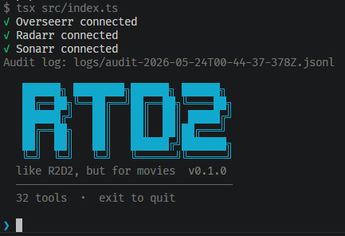

# RTD2

Media tools for managing a Plex library backed by Overseerr, Radarr, Sonarr, and MDBList.

The durable shape of the repo is:

```text
Claude/Codex skills + MCP tools + tested media service clients
```

It can find things to watch, inspect low-quality downloads, re-grab bad files, fix Plex matches, and manage requests. The preferred integration path is Claude/Codex using the skills plus MCP tools. The terminal agent still exists as a local harness.

Source code stays TypeScript-only. The `.js` suffixes in TypeScript imports are intentional for Node ESM / `NodeNext`; `tsc` emits the runtime JavaScript into gitignored `dist/`.



## Layout

```text
src/
  clients/      reusable Plex and MDBList client logic
  tools/        AI/MCP tool wrappers, schemas, idempotency, output envelopes
  workflows/    deterministic cross-service flows
  mcp/          stdio MCP server exposing the tool registry
  cli/          optional Ink/AI SDK terminal agent harness
skills/         Claude/Codex workflow instructions
evals/          agent/tool-sequence evals
```

## Prompts

```text
find low-quality movie files and show me the best upgrade candidates before deleting anything
```

```text
check Severance season 1 for missing or low-quality episodes, then tell me whether to run a season search or fix episodes one by one
```

```text
what should I watch tonight from my unwatched library, something tense but not horror?
```

```text
request The Insider if it is not already in my library or pending
```

```text
what am I missing by David Fincher?
```

```text
where can I stream Anatomy of a Fall before I request it?
```

```text
show me pending requests and approve the good ones
```

```text
this Plex match is wrong for Solaris, show me the alternate matches before changing it
```

```text
sync my mdblist watchlist with Overseerr
```

```text
what was recently added to Plex that I have not watched yet?
```

```text
show me my recent watch history and recommend something similar from the library
```

```text
find highly rated sci-fi movies I am missing
```

```text
how many requests do I have left this month?
```

```text
report a video quality issue for Gods and Monsters, then show the safest regrab options
```

```text
remove this bad Radarr movie entry but keep the file on disk
```

```text
any requests from last month that still have not downloaded?
```

```text
what is in my library by Denis Villeneuve, and which of his am I missing?
```

```text
my library is getting huge, what unwatched stuff looks safe to prune?
```

```text
add Dune: Part Three when it is available
```

## Getting Started

```bash
nix develop
pnpm install
cp .env.example .env
$EDITOR .env
# fill in the env
pnpm dev
```

Useful commands:

```bash
pnpm test
pnpm typecheck
pnpm build
pnpm mcp
pnpm mcp:dev
```

`pnpm dev` runs the optional terminal agent from TypeScript. `pnpm mcp:dev` runs the MCP server from TypeScript with `tsx`.

## MCP

For host integrations, prefer the compiled MCP server:

```bash
pnpm build
pnpm mcp
```

It exposes the same tool names from `src/tool-registry.ts`. Read-only tools run normally. Mutating tools are blocked unless the server is launched with `MCP_ALLOW_MUTATIONS=1`; use that only when your MCP host provides an approval surface you trust.

Example MCP command:

```json
{
  "command": "pnpm",
  "args": ["mcp"],
  "cwd": "/path/to/rtd2"
}
```

During development, use:

```json
{
  "command": "pnpm",
  "args": ["mcp:dev"],
  "cwd": "/path/to/rtd2"
}
```

## Skills

The skills in `skills/` are workflow instructions for Claude/Codex. They should explain how to compose tools, not contain executable API logic.

- `media-list-gaps` - MDBList to Plex gap checks.
- `media-quality-audit` - Plex file-quality inspection and safe replacement follow-up.
- `media-request-flow` - Overseerr/Seerr request and approval discipline.
- `media-recommendations` - library-first watch recommendations.
- `scratch-sqlite` - temporary SQLite scratch space for large datasets.
